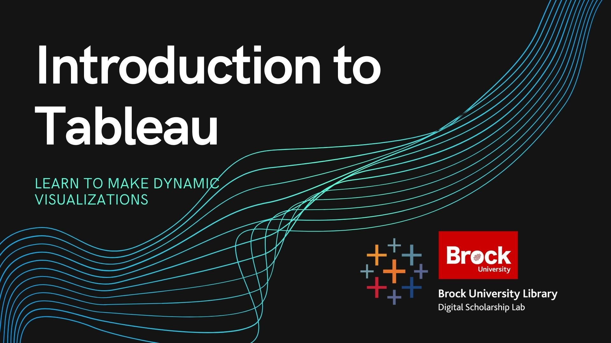

# Introduction to Tableau Part 1
This workshop will introduce the most basic functions of Tableau Public such as connecting to a dataset, navigating the workspace, and how to build basic data visualizations.

----

## Setup Instructions
In preparation for this workshop, you will need to download and install the latest version of Tableau Public which can be done using the link below.
  
[Download Tableau Public](https://public.tableau.com/s/download/public/pc64)

You will also need to download the two excel workbooks found
Include:
 - All software that needs to be downloaded
 - Any accounts that will need to be made including links to the sign up pages for those accounts
 - All files that will need to be downloaded in order to participate in the workshop as well as instructions on exactly how to download them.  

For all of the above, keep in mind that some of our attendees could be using machines on campus and therefore might have limitations in regards to downloading tools and files.

----

## Helpful Materials
Add in any helpful resources, code snippets, cheat sheets, or other relevant information here.

----

## Follow Up Material
Add in names of books, links to websites, or any other reccomendations for follow up materials that could represent the "Next Step" in an attendees learning after the workshop.  helpful links like the Programming Historians or W3Schools are good examples.

----
  
**End notes**
This is where you mention the DSL, MDGL, or Research Lifecycle department and put in contact information.  An example of what this might look like is:

**This workshop is brought to you by the Brock University Digital Scholarship Lab.  For a listing of our upcoming workshops go to [Experience BU](https://experiencebu.brocku.ca/organization/dsl) if you are a Brock affiliate or [Eventbrite page](https://www.eventbrite.ca/o/brock-university-digital-scholarship-lab-21661627350) for external attendees.  For additional inquiries, contact [DSL@Brocku.ca](mailto:DSL@Brocku.ca)**

